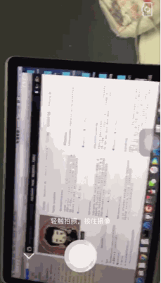
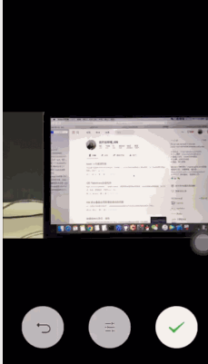
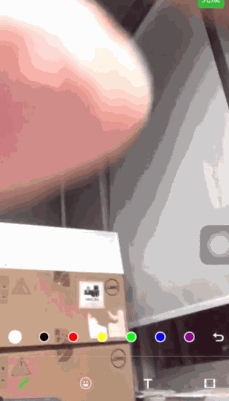
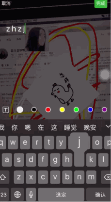
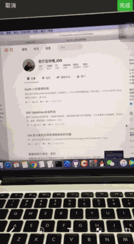
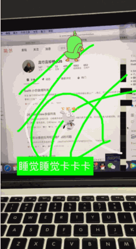
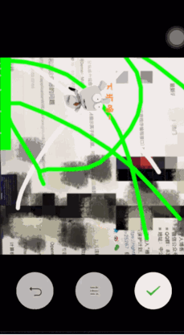
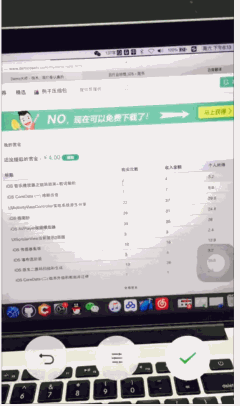
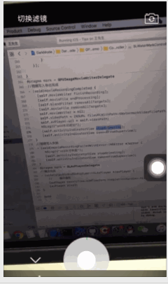

# iOS_Tips
iOS的一些示例，不定时更新~  简书地址：https://www.jianshu.com/p/a2a04cabb98d

### 目录 
> 1、暗黑模式  2、AppleID登录应用  3、AVFoundation 高仿微信相机拍摄和编辑 4、AVFoundation 人脸检测  5、AVFoundation 实时滤镜 6、GPUImage框架的使用

## 1、 暗黑模式适配

  
## 2、AppleID登录应用

* 文件夹 AddingTheSignInWithAppleFlowToYourApp

## 3、微信相机拍摄照片、小视频以及编辑功能  
> 效果描述：  
> * 1、自定义相机 拍摄视频和照片
> * 2、切换前后摄像头、调整焦距/设置聚焦点、横屏拍摄
> * 3、视频编辑：涂鸦、gif贴图、文字水印、视频裁剪 、添加背景音乐 
> * 4 、图片编辑：涂鸦、贴图、文字水印、马赛克、图片裁剪

> 主要类：SLAvCaptureTool(音视频采集录制工具)、SLAvEditExport(导出编辑的音视频)、

||||

*****

||||

****

|||

## 4、人脸检测 

## 5、实时滤镜拍摄和导出

>  主要类: 是由SLAvCaptureTool拆分的 SLAvCaptureSession（采集） + SLAvWriterInput（录制） 两个工具类，方便扩展，实现的方式也略有不同

## 6、GPUImage框架的使用

> 效果描述：实时拍摄添加水印和滤镜、本地视频添加水印、GIF图水印

欢迎扫描下方二维码关注——iOS开发进阶之路——微信公众号：iOS2679114653 本公众号是一个iOS开发者们的分享，交流，学习平台，会不定时的发送技术干货，源码,也欢迎大家积极踊跃投稿，(择优上头条) ^_^分享自己开发攻城的过程，心得，相互学习，共同进步，成为攻城狮中的翘楚！

