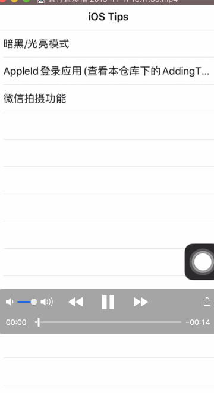

# iOS_Tips
iOS的一些示例，不定时更新

## 1、 暗黑模式适配

  

## 2、AppleID登录应用

## 3、微信相机拍摄照片、小视频以及编辑功能

> ##### 效果描述：
> * 1、拍摄视频和照片
> * 2、切换前后摄像头、调整焦距、横屏拍摄
> * 3、视频编辑：涂鸦、贴图、文字水印、视频裁剪 、添加背景音乐
> * 4 、图片编辑：涂鸦、贴图、文字水印、马赛克、图片裁剪

 
 
  
  
   
