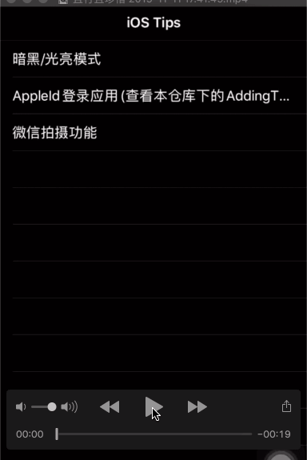
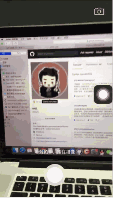

# iOS_Tips
iOS的一些示例，不定时更新~
### 目录 
> 1、暗黑模式  2、AppleID登录应用  3、微信相机拍摄照片、小视频以及编辑功能 4、人脸识别  5、滤镜（doing）

## 1、 暗黑模式适配

  
## 2、AppleID登录应用

* 文件夹 AddingTheSignInWithAppleFlowToYourApp

## 3、微信相机拍摄照片、小视频以及编辑功能  
> 效果描述：  
> * 1、自定义相机 拍摄视频和照片
> * 2、切换前后摄像头、调整焦距/设置聚焦点、横屏拍摄
> * 3、视频编辑：涂鸦、gif贴图、文字水印、视频裁剪 、添加背景音乐 
> * 4 、图片编辑：涂鸦、贴图、文字水印、马赛克、图片裁剪

||

*****

|||

****

|||

****

|||

## 4、人脸识别 

## 5、滤镜 （doing）

欢迎扫描下方二维码关注——iOS开发进阶之路——微信公众号：iOS2679114653 本公众号是一个iOS开发者们的分享，交流，学习平台，会不定时的发送技术干货，源码,也欢迎大家积极踊跃投稿，(择优上头条) ^_^分享自己开发攻城的过程，心得，相互学习，共同进步，成为攻城狮中的翘楚！

